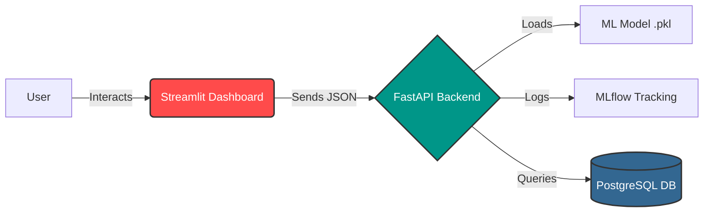

# 🏪 Rossmann Sales Prediction Pipeline


---

An **end-to-end Machine Learning solution** to predict **daily sales** for Rossmann drug stores.
This project implements a complete **MLOps pipeline**, including data extraction, experiment tracking, model deployment via REST API, and a user-friendly dashboard.

---

## ✨ Features

- **Machine Learning:** Random Forest Regressor trained on store, promotion, and competitor data.
- **Experiment Tracking:** Uses **MLflow** to track model metrics and parameters.
- **Backend API:** Served using **FastAPI** for real-time predictions.
- **Frontend Dashboard:** Interactive UI built with **Streamlit**.
- **Containerization:** Fully Dockerized for easy deployment with **Docker Compose**.
- **Database:** **PostgreSQL** integration for raw data storage.

---

## 🏗️ System Architecture



---

## 🧠 Tech Stack

| Category | Tools / Libraries |
| --- | --- |
| **Language** | Python 3.10 |
| **ML Libraries** | Scikit-Learn, Pandas, NumPy |
| **Web Frameworks** | FastAPI (Backend), Streamlit (Frontend) |
| **DevOps** | Docker, Docker Compose |
| **Tools** | MLflow, Uvicorn |

---

## 📂 Project Structure

```text
├── models/                  # Serialized models (.pkl)
├── notebooks/               # Jupyter notebooks for EDA
├── src/
│   ├── app/
│   │   ├── api.py           # FastAPI Backend
│   │   └── dashboard.py     # Streamlit Frontend
│   └── scripts/
│       ├── train_model.py   # Training script
│       └── ...
├── docker-compose.yml       # Container orchestration
├── Dockerfile               # Image definition
├── requirements.txt         # Python dependencies
└── README.md                # Project documentation

```

---

## ⚡ Quick Start (Docker)

The easiest way to run the application is using Docker Compose.

**1. Clone the repository**

```bash
git git clone [https://github.com/ksnishat/rossmann-sales-pipeline.git](https://github.com/ksnishat/rossmann-sales-pipeline.git)
cd rossmann-sales-pipeline

```

**2. Build and Launch**

```bash
docker compose up --build

```

**3. Access the Services**

* **Dashboard:** [http://localhost:8501](https://www.google.com/search?q=http://localhost:8501)
* **API Documentation:** [http://localhost:8000/docs](https://www.google.com/search?q=http://localhost:8000/docs)

---

## 🧪 Manual Installation (Optional)

If you prefer running without Docker:

**1. Create a virtual environment**

```bash
python -m venv venv
source venv/bin/activate  # On Windows: venv\Scripts\activate

```

**2. Install dependencies**

```bash
pip install -r requirements.txt

```

**3. Run the API**

```bash
uvicorn src.app.api:app --reload

```

**4. Run the Dashboard**

```bash
streamlit run src/app/dashboard.py

```

---

## 📊 Usage

**Predicting Sales**

1. Open the Dashboard at [http://localhost:8501](https://www.google.com/search?q=http://localhost:8501).
2. Enter the **Store ID** (e.g., 1115), **Day of Week**, and **Promotion** status.
3. Click **Predict Sales**.
4. The model will return the estimated sales in Euros (€).

---

## 🔮 Future Improvements

* Add Cloud Deployment (AWS / Azure).
* Implement Drift Detection.
* Add Unit Tests with PyTest.

---

## 🧑‍💻 Author

**Khaled Saifullah**

* 🔗 [GitHub Profile](https://github.com/ksnishat)
* 📧 [Email Me](mailto:ksnishat@gmail.com)

## 🪪 License

This project is licensed under the MIT License.

```