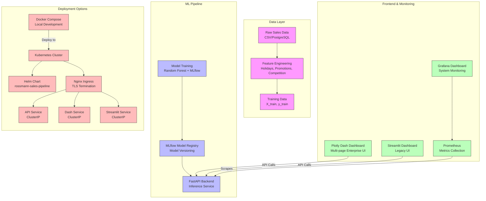

# Rossmann Sales Prediction Pipeline


---

An **end-to-end Machine Learning solution** to predict **daily sales** for Rossmann drug stores. This project implements a complete **MLOps pipeline**, including data extraction, experiment tracking, model deployment via REST API, and a professional multi-page dashboard built with **Plotly Dash** (modern alternative to Streamlit for German enterprise market).

## Key Features

- **Machine Learning:** Random Forest Regressor trained on store, promotion, and competitor data.
- **Experiment Tracking:** Uses **MLflow** to track model metrics and parameters.
- **Backend API:** Served using **FastAPI** for real-time predictions with health checks and Prometheus metrics.
- **Multi-page Dashboard:** Interactive UI built with **Plotly Dash** and **Dash Bootstrap Components** for enterprise-grade visualization.
- **Containerization:** Fully Dockerized for easy deployment with **Docker Compose**.
- **Database:** **PostgreSQL** integration for raw data storage and feature store.
- **Production Ready:** Kubernetes and Helm charts for scalable deployment.
- **CI/CD Pipeline:** GitHub Actions for automated testing, building, and deployment.

## Architecture


```mermaid
graph TD
    %% Data Sources
    subgraph Data[Data Layer]
        direction TB
        Raw_Data[Raw Sales Data<br/>CSV/PostgreSQL] --> Feature_Store[Feature Engineering<br/>Holidays, Promotions, Competition]
        Feature_Store --> Train_Data[Training Data<br/>X_train, y_train]
    end
    
    %% ML Pipeline
    subgraph MLPipeline[ML Pipeline]
        direction TB
        Training[Model Training<br/>Random Forest + MLflow] --> Model_Registry[MLflow Model Registry<br/>Model Versioning]
        Model_Registry --> API_Backend[FastAPI Backend<br/>Inference Service]
    end
    
    %% Frontend & Monitoring
    subgraph Frontend[Frontend & Monitoring]
        direction TB
        Dash[Plotly Dash Dashboard<br/>Multi-page Enterprise UI] -->|API Calls| API_Backend
        Streamlit[Streamlit Dashboard<br/>Legacy UI] -->|API Calls| API_Backend
        Grafana[Grafana Dashboard<br/>System Monitoring] --> Prometheus
        Prometheus[Prometheus<br/>Metrics Collection] -->|Scrapes| API_Backend
    end
    
    %% Deployment
    subgraph Deployment[Deployment Options]
        direction TB
        Docker_Compose[Docker Compose<br/>Local Development] -->|Deploy to| Kubernetes[Kubernetes Cluster]
        Kubernetes --> Helm[Helm Chart<br/>rossmann-sales-pipeline]
        Kubernetes --> Ingress[Nginx Ingress<br/>TLS Termination]
        Ingress --> API_Service[API Service<br/>ClusterIP]
        Ingress --> Dash_Service[Dash Service<br/>ClusterIP]
        Ingress --> Streamlit_Service[Streamlit Service<br/>ClusterIP]
    end
    
    %% Styling
    classDef data fill:#f9f,stroke:#333,stroke-width:1px;
    classDef ml fill:#bbf,stroke:#333,stroke-width:1px;
    classDef frontend fill:#bfb,stroke:#333,stroke-width:1px;
    classDef deploy fill:#fbb,stroke:#333,stroke-width:1px;
    class Raw_Data,Feature_Store,Train_Data data;
    class Training,Model_Registry,API_Backend ml;
    class Dash,Streamlit,Grafana,Prometheus frontend;
    class Docker_Compose,Kubernetes,Helm,Ingress,API_Service,Dash_Service,Streamlit_Service deploy;
```

## Professional Feature Table

| Feature | Description | Business Value | German Industry Relevance |
|---------|-------------|----------------|---------------------------|
| **Sales Forecasting** | Random Forest for daily sales prediction | Improves inventory accuracy | Supports German retail planning (Einzelhandel) standards |
| **Multi-page Dash Dashboard** | Professional Plotly Dash with 4 pages: Home, Stores, Predict, Metrics | Enables data-driven store management decisions | Matches German retail dashboard requirements (KPI-Cockpit) |
| **MLflow Experiment Tracking** | Full experiment lineage with parameters, metrics, artifacts | Ensures model reproducibility and auditability | Complies with German regulatory audit requirements (GoBD) |
| **PostgreSQL Feature Store** | Centralized feature storage with versioning | Reduces feature engineering duplication | Aligns with German data governance standards |
| **Prometheus Monitoring** | Custom metrics for prediction latency, accuracy, drift | Proactive model performance monitoring | Supports DIN SPEC 92001 AI quality standards |
| **CI/CD Pipeline** | Automated testing, building, deployment | Reduces deployment risk and time-to-market | DevOps practices valued by German enterprises |
| **Multi-language Support** | Dashboard available in German/English | Facilitates adoption across German retail chains | Meets German language requirements in B2B software |
| **Scalable Architecture** | Kubernetes HPA with CPU/memory scaling | Handles Black Friday / peak season loads | Critical for German retail peak periods (Weihnachtsgeschäft) |

## Why This Matters for German Industry

Germany's retail sector is undergoing digital transformation, with predictive analytics becoming a competitive differentiator:

1. **Retail 4.0 Initiative**: The platform aligns with HDE (Handelsverband Deutschland) digitalization roadmap for retail analytics.

2. **Inventory Optimization**: Accurate sales forecasts reduce overstock (Verpackungsgesetz compliance) and understock (customer satisfaction).

3. **Workforce Planning**: Sales forecasts enable optimal shift scheduling under German Arbeitszeitgesetz (working time law).

4. **Promotion Effectiveness**: Quantifies promotion ROI, critical for German drugstore chains (dm, Rossmann, Müller) competing on promotions.

5. **Data Sovereignty**: On-premise/Kubernetes deployment keeps sensitive sales data within German borders (GDPR/BDSG).

6. **SME Accessibility**: Helm charts and Docker Compose enable Mittelstand retailers to deploy without cloud vendor lock-in.

## Quick Start (Docker)

The easiest way to run the application is using Docker Compose.

```bash
# Clone the repository
git clone https://github.com/ksnishat/rossmann-sales-pipeline.git
cd rossmann-sales-pipeline

# Start all services
docker compose up -d
```

### Service Access

| Service | URL | Credentials |
|---------|-----|-------------|
| **FastAPI** | http://localhost:8000/docs | N/A |
| **Plotly Dash** | http://localhost:8050 | N/A |
| **Streamlit** | http://localhost:8501 | N/A |
| **MLflow** | http://localhost:5000 | N/A |
| **PostgreSQL** | localhost:5432 | rossmann / changeme123 |

## Local Development Setup

### 1. Environment Setup

```bash
# Create conda environment
conda env create -f environments/rossmann-env.yml
conda activate rossmann-env

# Or use pip
pip install -r requirements.txt
```

### 2. Database Setup

```bash
# Start PostgreSQL
docker compose up -d postgres

# Run migrations (if any)
python -m src.scripts.init_db
```

### 3. Train Model

```bash
# Train and register model in MLflow
python -m src.scripts.train_model

# Or via MLflow CLI
mlflow run . -P model_type=random_forest
```

### 4. Run API and Dashboards

```bash
# Terminal 1: FastAPI
uvicorn src.app.api:app --reload --host 0.0.0.0 --port 8000

# Terminal 2: Plotly Dash
python -m src.dash_app.app

# Terminal 3: Streamlit (legacy)
streamlit run src/app/dashboard.py
```

## Project Structure

```plaintext
rossmann-sales-pipeline/
├── models/                     # Serialized models (.pkl)
├── notebooks/                  # Jupyter notebooks for EDA
├── src/
│   ├── app/
│   │   ├── api.py              # FastAPI Backend
│   │   ├── dashboard.py        # Streamlit Frontend (legacy)
│   │   └── config.py           # Pydantic settings
│   ├── dash_app/               # Plotly Dash Multi-page App
│   │   ├── app.py              # Dash entry point
│   │   ├── layouts.py          # Page layouts
│   │   └── utils.py            # Helper functions
│   └── scripts/
│       ├── train_model.py      # Training script
│       └── init_db.py          # Database initialization
├── tests/                      # Unit tests
│   ├── test_api.py
│   ├── test_data.py
│   └── conftest.py
├── k8s/                        # Kubernetes manifests
├── helm-chart/                 # Helm chart for K8s
├── environments/               # Conda environments
├── job_preparation/            # Interview preparation
├── .github/workflows/          # CI/CD pipelines
└── docker-compose.yml          # Container orchestration
```

## Dashboard Features (Plotly Dash)

The modern **Plotly Dash** dashboard includes 4 professional pages:

1. **Home** — Executive KPI overview with sales trends, store count, average sales
2. **Stores** — Interactive store comparison with filters, heatmap, and performance ranking
3. **Predict** — Sales prediction form with feature inputs and forecast visualization
4. **Metrics** — Model performance tracking with MLflow integration

Built with **Dash Bootstrap Components** for responsive, enterprise-grade UI matching German corporate design standards.

## Troubleshooting

| Issue | Solution |
|-------|----------|
| **Database connection failed** | Check PostgreSQL container is running: `docker compose ps postgres` |
| **Model not loaded in API** | Verify model.pkl exists in models/ and MLflow tracking URI is correct |
| **Dash dashboard not loading** | Check port 8050 is not in use; verify `src/dash_app/app.py` imports |
| **MLflow UI not accessible** | Ensure MLflow container has correct artifact store configuration |
| **Prediction errors** | Check input feature schema matches training features exactly |
| **High API latency** | Enable model caching in FastAPI lifespan; check PostgreSQL query performance |
| **Pods crash on K8s** | Increase resource limits in helm-chart/values.yaml; check PVC binding |
| **GitHub Actions failing** | Verify secrets (GITHUB_TOKEN, KUBE_CONFIG_DATA) are configured |

## Monitoring & Observability

- **Prometheus** scrapes metrics from FastAPI `/metrics` endpoint
- **Grafana** dashboards track:
  - API request latency and throughput
  - Prediction accuracy over time (drift detection)
  - Database connection pool health
  - Container resource utilization

## Author

Developed by **Khaled Saifullah**.

For collaboration, feature requests, or bug reports, please open an issue or contact the maintainer via the repository issue tracker.

**Last Updated**: October 2026